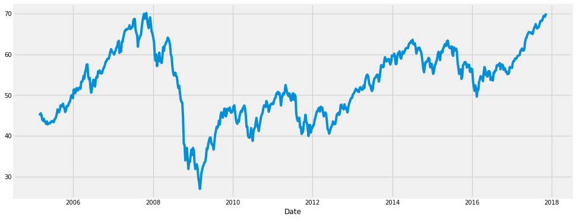
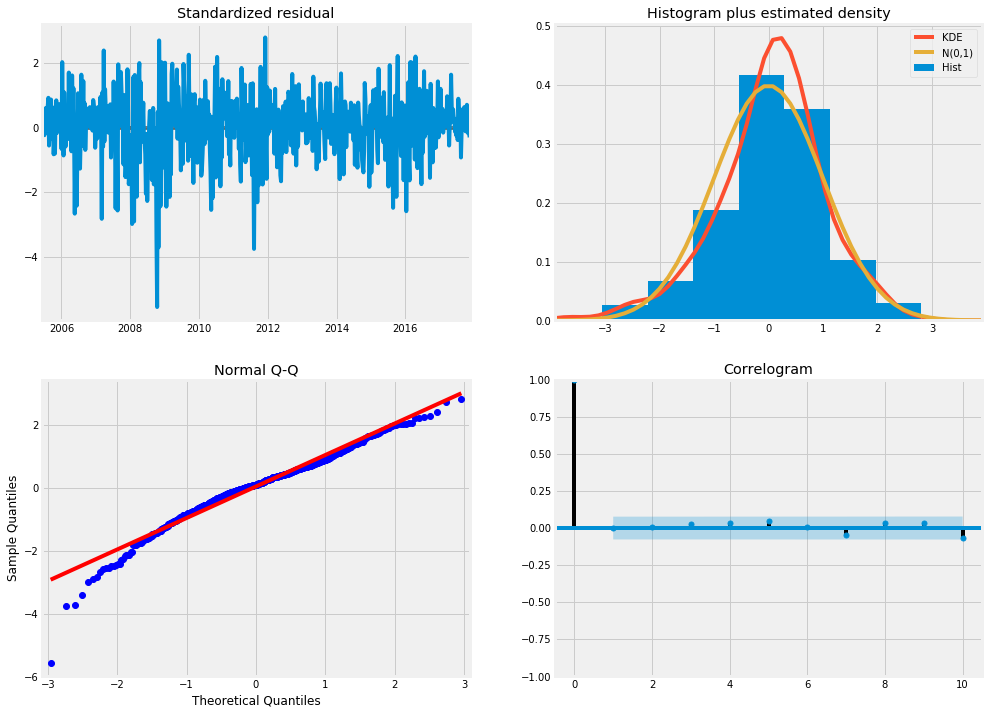
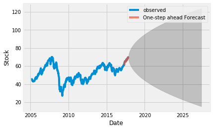
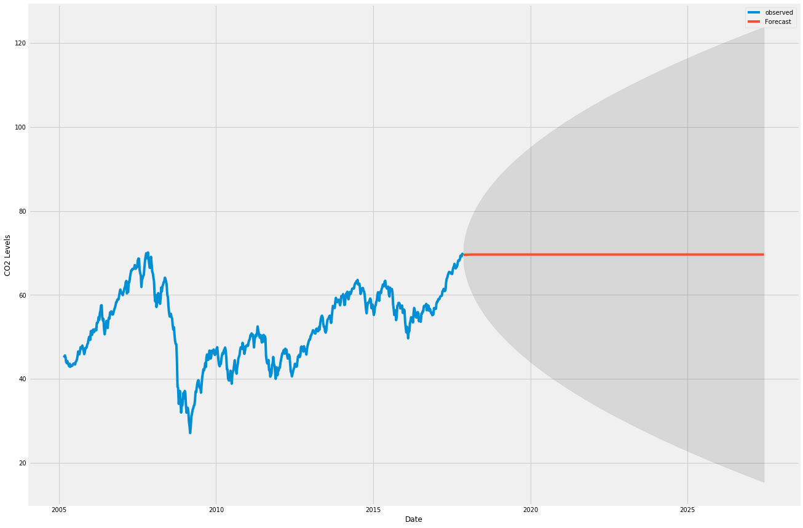

```python
import pandas as pd
import numpy as np
import matplotlib.pylab as plt
%matplotlib inline
from matplotlib.pylab import rcParams
rcParams['figure.figsize'] = 15, 6
from datetime import datetime
from statsmodels.tsa.arima_model import ARIMA
from sklearn.metrics import mean_squared_error
import os
import warnings
import itertools
import pandas as pd
import numpy as np
import statsmodels.api as sm
import matplotlib.pyplot as plt
plt.style.use('fivethirtyeight')
```


```python
# pwd
```


```python
data = pd.read_csv('Data/efa.us.txt')
```


```python
data = data[['Date', 'Close']]
data=data.set_index(data.Date)
# data=data.drop("Date",axis=1)
data.index = pd.DatetimeIndex(data.index)
# data=data['2010-01-01':]
# data= data['Close']
# data.head()
# ts=data
data.head()
y=data
data.head()

```


<div>
<style scoped>
    .dataframe tbody tr th:only-of-type {
        vertical-align: middle;
    }

    .dataframe tbody tr th {
        vertical-align: top;
    }

    .dataframe thead th {
        text-align: right;
    }
</style>
<table border="1" class="dataframe">
  <thead>
    <tr style="text-align: right;">
      <th></th>
      <th>Date</th>
      <th>Close</th>
    </tr>
    <tr>
      <th>Date</th>
      <th></th>
      <th></th>
    </tr>
  </thead>
  <tbody>
    <tr>
      <th>2005-02-25</th>
      <td>2005-02-25</td>
      <td>45.119</td>
    </tr>
    <tr>
      <th>2005-02-28</th>
      <td>2005-02-28</td>
      <td>45.010</td>
    </tr>
    <tr>
      <th>2005-03-01</th>
      <td>2005-03-01</td>
      <td>45.257</td>
    </tr>
    <tr>
      <th>2005-03-02</th>
      <td>2005-03-02</td>
      <td>44.919</td>
    </tr>
    <tr>
      <th>2005-03-03</th>
      <td>2005-03-03</td>
      <td>44.945</td>
    </tr>
  </tbody>
</table>
</div>


```python
y = data['Close'].resample('W-MON').mean()
```


```python
# The term bfill means that we use the value before filling in missing values
y = y.fillna(y.bfill())
print(y)

```

    Date
    2005-02-28    45.06450
    2005-03-07    45.27820
    2005-03-14    45.55300
    2005-03-21    45.08000
    2005-03-28    44.02900
    2005-04-04    43.72980
    2005-04-11    44.21740
    2005-04-18    43.59000
    2005-04-25    43.39460
    2005-05-02    42.96780
    2005-05-09    43.59480
    2005-05-16    42.84620
    2005-05-23    43.05520
    2005-05-30    43.19800
    2005-06-06    43.07340
    2005-06-13    43.34640
    2005-06-20    43.59160
    2005-06-27    43.66460
    2005-07-04    43.42300
    2005-07-11    43.41280
    2005-07-18    44.06700
    2005-07-25    44.22760
    2005-08-01    44.65660
    2005-08-08    45.42760
    2005-08-15    46.51080
    2005-08-22    46.06020
    2005-08-29    45.82700
    2005-09-05    46.48975
    2005-09-12    47.52500
    2005-09-19    47.29980
                    ...   
    2017-04-24    61.12460
    2017-05-01    62.88840
    2017-05-08    63.80900
    2017-05-15    64.09680
    2017-05-22    64.72840
    2017-05-29    65.12850
    2017-06-05    65.46040
    2017-06-12    65.39560
    2017-06-19    65.33640
    2017-06-26    65.08600
    2017-07-03    65.30600
    2017-07-10    64.94750
    2017-07-17    65.83800
    2017-07-24    66.50400
    2017-07-31    66.75400
    2017-08-07    67.39000
    2017-08-14    66.52000
    2017-08-21    66.30200
    2017-08-28    66.56800
    2017-09-04    66.69000
    2017-09-11    67.30800
    2017-09-18    68.06800
    2017-09-25    68.27200
    2017-10-02    68.14600
    2017-10-09    68.50600
    2017-10-16    69.33400
    2017-10-23    69.36800
    2017-10-30    69.17400
    2017-11-06    69.78800
    2017-11-13    69.56500
    Freq: W-MON, Name: Close, Length: 664, dtype: float64


```python
y.plot(figsize=(15, 6))
plt.show()
```





```python
p = d = q = range(0, 2)

# Generate all different combinations of p, q and q triplets
pdq = list(itertools.product(p, d, q))

# Generate all different combinations of seasonal p, q and q triplets
seasonal_pdq = [(x[0], x[1], x[2], 12) for x in list(itertools.product(p, d, q))]

print('Examples of parameter combinations for Seasonal ARIMA...')
print('SARIMAX: {} x {}'.format(pdq[1], seasonal_pdq[1]))
print('SARIMAX: {} x {}'.format(pdq[1], seasonal_pdq[2]))
print('SARIMAX: {} x {}'.format(pdq[2], seasonal_pdq[3]))
print('SARIMAX: {} x {}'.format(pdq[2], seasonal_pdq[4]))
```

    Examples of parameter combinations for Seasonal ARIMA...
    SARIMAX: (0, 0, 1) x (0, 0, 1, 12)
    SARIMAX: (0, 0, 1) x (0, 1, 0, 12)
    SARIMAX: (0, 1, 0) x (0, 1, 1, 12)
    SARIMAX: (0, 1, 0) x (1, 0, 0, 12)


```python
warnings.filterwarnings("ignore") # specify to ignore warning messages

for param in pdq:
    for param_seasonal in seasonal_pdq:
        try:
            mod = sm.tsa.statespace.SARIMAX(y,
                                            order=param,
                                            seasonal_order=param_seasonal,
                                            enforce_stationarity=False,
                                            enforce_invertibility=False)

            results = mod.fit()

            print('ARIMA{}x{}12 - AIC:{}'.format(param, param_seasonal, results.aic))
        except:
            continue
```

    ARIMA(0, 0, 0)x(0, 0, 0, 12)12 - AIC:7160.996257330355
    ARIMA(0, 0, 0)x(0, 0, 1, 12)12 - AIC:6225.337040193439
    ARIMA(0, 0, 0)x(0, 1, 0, 12)12 - AIC:3793.0629431991856
    ARIMA(0, 0, 0)x(0, 1, 1, 12)12 - AIC:3718.7020702265754
    ARIMA(0, 0, 0)x(1, 0, 0, 12)12 - AIC:3797.36956037455
    ARIMA(0, 0, 0)x(1, 0, 1, 12)12 - AIC:3778.9483469134943
    ARIMA(0, 0, 0)x(1, 1, 0, 12)12 - AIC:3722.620407054176
    ARIMA(0, 0, 0)x(1, 1, 1, 12)12 - AIC:3718.9101111984683
    ARIMA(0, 0, 1)x(0, 0, 0, 12)12 - AIC:6251.809914938383
    ARIMA(0, 0, 1)x(0, 0, 1, 12)12 - AIC:5348.957918824209
    ARIMA(0, 0, 1)x(0, 1, 0, 12)12 - AIC:3123.0823772636068
    ARIMA(0, 0, 1)x(0, 1, 1, 12)12 - AIC:3073.976077715365
    ARIMA(0, 0, 1)x(1, 0, 0, 12)12 - AIC:3132.4597854403264
    ARIMA(0, 0, 1)x(1, 0, 1, 12)12 - AIC:3124.1609931907806
    ARIMA(0, 0, 1)x(1, 1, 0, 12)12 - AIC:3084.094092237001
    ARIMA(0, 0, 1)x(1, 1, 1, 12)12 - AIC:3076.4498340127648
    ARIMA(0, 1, 0)x(0, 0, 0, 12)12 - AIC:1963.6039728418168
    ARIMA(0, 1, 0)x(0, 0, 1, 12)12 - AIC:1938.4215698848793
    ARIMA(0, 1, 0)x(0, 1, 0, 12)12 - AIC:2369.386670268818
    ARIMA(0, 1, 0)x(0, 1, 1, 12)12 - AIC:1940.160415136109
    ARIMA(0, 1, 0)x(1, 0, 0, 12)12 - AIC:1940.4913476171328
    ARIMA(0, 1, 0)x(1, 0, 1, 12)12 - AIC:1940.351374579089
    ARIMA(0, 1, 0)x(1, 1, 0, 12)12 - AIC:2182.7271614944248
    ARIMA(0, 1, 0)x(1, 1, 1, 12)12 - AIC:1942.160342108018
    ARIMA(0, 1, 1)x(0, 0, 0, 12)12 - AIC:1948.5705700709816
    ARIMA(0, 1, 1)x(0, 0, 1, 12)12 - AIC:1923.5113233858347
    ARIMA(0, 1, 1)x(0, 1, 0, 12)12 - AIC:2355.0829074187386
    ARIMA(0, 1, 1)x(0, 1, 1, 12)12 - AIC:1924.9891543329134
    ARIMA(0, 1, 1)x(1, 0, 0, 12)12 - AIC:1927.551484318587
    ARIMA(0, 1, 1)x(1, 0, 1, 12)12 - AIC:1925.445352483866
    ARIMA(0, 1, 1)x(1, 1, 0, 12)12 - AIC:2174.160596204665
    ARIMA(0, 1, 1)x(1, 1, 1, 12)12 - AIC:1926.989081769624
    ARIMA(1, 0, 0)x(0, 0, 0, 12)12 - AIC:1967.1130919984732
    ARIMA(1, 0, 0)x(0, 0, 1, 12)12 - AIC:1941.9671517537456
    ARIMA(1, 0, 0)x(0, 1, 0, 12)12 - AIC:2355.583381153469
    ARIMA(1, 0, 0)x(0, 1, 1, 12)12 - AIC:1943.6260066030175
    ARIMA(1, 0, 0)x(1, 0, 0, 12)12 - AIC:1941.9519163450268
    ARIMA(1, 0, 0)x(1, 0, 1, 12)12 - AIC:1943.8146857530144
    ARIMA(1, 0, 0)x(1, 1, 0, 12)12 - AIC:2174.499001566671
    ARIMA(1, 0, 0)x(1, 1, 1, 12)12 - AIC:1945.6257743951405
    ARIMA(1, 0, 1)x(0, 0, 0, 12)12 - AIC:1952.3079042345373
    ARIMA(1, 0, 1)x(0, 0, 1, 12)12 - AIC:1927.495443544354
    ARIMA(1, 0, 1)x(0, 1, 0, 12)12 - AIC:2335.6333491106607
    ARIMA(1, 0, 1)x(0, 1, 1, 12)12 - AIC:1927.5708691523396
    ARIMA(1, 0, 1)x(1, 0, 0, 12)12 - AIC:1929.2213376962113
    ARIMA(1, 0, 1)x(1, 0, 1, 12)12 - AIC:1929.117336357753
    ARIMA(1, 0, 1)x(1, 1, 0, 12)12 - AIC:2163.028283986321
    ARIMA(1, 0, 1)x(1, 1, 1, 12)12 - AIC:1929.5706808600155
    ARIMA(1, 1, 0)x(0, 0, 0, 12)12 - AIC:1951.2204282268901
    ARIMA(1, 1, 0)x(0, 0, 1, 12)12 - AIC:1926.1373222300538
    ARIMA(1, 1, 0)x(0, 1, 0, 12)12 - AIC:2358.284570566223
    ARIMA(1, 1, 0)x(0, 1, 1, 12)12 - AIC:1928.0731216322383
    ARIMA(1, 1, 0)x(1, 0, 0, 12)12 - AIC:1926.2102426545866
    ARIMA(1, 1, 0)x(1, 0, 1, 12)12 - AIC:1928.0652260838424
    ARIMA(1, 1, 0)x(1, 1, 0, 12)12 - AIC:2172.100695574495
    ARIMA(1, 1, 0)x(1, 1, 1, 12)12 - AIC:1930.0731303304408
    ARIMA(1, 1, 1)x(0, 0, 0, 12)12 - AIC:1950.3684434675633
    ARIMA(1, 1, 1)x(0, 0, 1, 12)12 - AIC:1925.3157678352645
    ARIMA(1, 1, 1)x(0, 1, 0, 12)12 - AIC:2357.0106892652016
    ARIMA(1, 1, 1)x(0, 1, 1, 12)12 - AIC:1926.7693994257631
    ARIMA(1, 1, 1)x(1, 0, 0, 12)12 - AIC:1927.4055104707522
    ARIMA(1, 1, 1)x(1, 0, 1, 12)12 - AIC:1927.2558177248306
    ARIMA(1, 1, 1)x(1, 1, 0, 12)12 - AIC:2173.0765494379075
    ARIMA(1, 1, 1)x(1, 1, 1, 12)12 - AIC:1928.7693260379851


```python
# lowerst AIC
# ARIMA(1, 1, 1)x(0, 0, 1, 12)12 - AIC:1925.3157678352645
```


```python
mod = sm.tsa.statespace.SARIMAX(y,
                                order=(1, 1, 1),
                                seasonal_order=(0, 0, 1, 12),
                                enforce_stationarity=False,
                                enforce_invertibility=False)

results = mod.fit()

print(results.summary().tables[1])
```

    ==============================================================================
                     coef    std err          z      P>|z|      [0.025      0.975]
    ------------------------------------------------------------------------------
    ar.L1         -0.1252      0.200     -0.627      0.530      -0.516       0.266
    ma.L1          0.2775      0.191      1.449      0.147      -0.098       0.653
    ma.S.L12       0.0292      0.034      0.860      0.390      -0.037       0.096
    sigma2         1.1234      0.045     24.857      0.000       1.035       1.212
    ==============================================================================


```python
results.plot_diagnostics(figsize=(15, 12))
plt.show()
```





# Step 6 — Validating Forecasts


```python
#predictions
# 2005-02-28'-2017-08-14
pred = results.get_prediction(start=pd.to_datetime('2017-04-24'), dynamic=False)
pred_ci = pred.conf_int()
pred_ci.head()
```


<div>
<style scoped>
    .dataframe tbody tr th:only-of-type {
        vertical-align: middle;
    }

    .dataframe tbody tr th {
        vertical-align: top;
    }

    .dataframe thead th {
        text-align: right;
    }
</style>
<table border="1" class="dataframe">
  <thead>
    <tr style="text-align: right;">
      <th></th>
      <th>lower Close</th>
      <th>upper Close</th>
    </tr>
    <tr>
      <th>Date</th>
      <th></th>
      <th></th>
    </tr>
  </thead>
  <tbody>
    <tr>
      <th>2017-04-24</th>
      <td>58.879962</td>
      <td>63.034683</td>
    </tr>
    <tr>
      <th>2017-05-01</th>
      <td>59.067300</td>
      <td>63.222021</td>
    </tr>
    <tr>
      <th>2017-05-08</th>
      <td>61.078237</td>
      <td>65.232958</td>
    </tr>
    <tr>
      <th>2017-05-15</th>
      <td>61.812799</td>
      <td>65.967519</td>
    </tr>
    <tr>
      <th>2017-05-22</th>
      <td>62.045824</td>
      <td>66.200545</td>
    </tr>
  </tbody>
</table>
</div>


```python
ax = y['2005-02-28':].plot(label='observed')
pred.predicted_mean.plot(ax=ax, label='One-step ahead Forecast', alpha=.7)

ax.fill_between(pred_ci.index,
                pred_ci.iloc[:, 0],
                pred_ci.iloc[:, 1], color='k', alpha=.2)

ax.set_xlabel('Date')
ax.set_ylabel('Stock')
plt.legend()

plt.show()
```





```python
y_forecasted = pred.predicted_mean
y_truth = y['2010-01-01':]

# Compute the mean square error
mse = ((y_forecasted - y_truth) ** 2).mean()
print('The Mean Squared Error of our forecasts is {}'.format(round(mse, 2)))

# The Mean Squared Error of our forecasts is 0.3
```

    The Mean Squared Error of our forecasts is 0.3


```python
# Get forecast EFA steps ahead in future
pred_uc = results.get_forecast(steps=500)

# Get confidence intervals of forecasts
pred_ci = pred_uc.conf_int()
```


```python
ax = y.plot(label='observed', figsize=(20, 15))
pred_uc.predicted_mean.plot(ax=ax, label='Forecast')
ax.fill_between(pred_ci.index,
                pred_ci.iloc[:, 0],
                pred_ci.iloc[:, 1], color='k', alpha=.1)
ax.set_xlabel('Date')
ax.set_ylabel('CO2 Levels')

plt.legend()
plt.show()
```





```python

# # specify training data
# data = ...
# # define model
# model = SARIMAX(data, order=..., seasonal_order=...)
# # fit model
# model_fit = model.fit()
# # one step forecast
# yhat = model_fit.predict(start=len(data), end=len(data))

# # # MODEL Fit 

# # mod = sm.tsa.statespace.SARIMAX(y,
# #                                 order=(1, 1, 1),
# #                                 seasonal_order=(1, 1, 1, 12),
# #                                 enforce_stationarity=False,
# #                                 enforce_invertibility=False)
# # results = mod.fit()
# # print(results.summary().tables[1])

# # #run before implment
# # results.plot_diagnostics(figsize=(15, 12))
# # plt.show()

# # #Get Prediction
# # pred = results.get_prediction(start=pd.to_datetime('1998-01-01'), dynamic=False)
# # pred_ci = pred.conf_int()

# # #Get accuracy of forecast 
# # y_forecasted = pred.predicted_mean
# # y_truth = y['1998-01-01':]

# # # Compute the mean square error
# # mse = ((y_forecasted - y_truth) ** 2).mean()
# # print('The Mean Squared Error of our forecasts is {}'.format(round(mse, 2)))

# # # Get forecast 500 steps ahead in future
# # pred_uc = results.get_forecast(steps=500)

# # # Get confidence intervals of forecasts
# # pred_ci = pred_uc.conf_int()
```


```python

```


```python

```


```python

```


```python
# READING DATA
# The P>|z| column informs us of the significance of each feature weight. Here, each weight has a p-value lower or close to 0.05, so it is reasonable to retain all of them in our model.
```


```python

```
