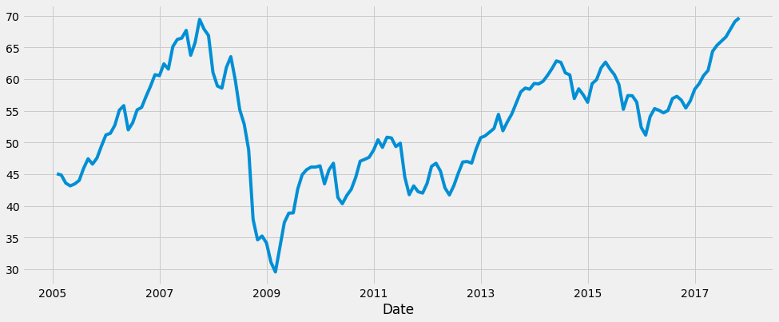
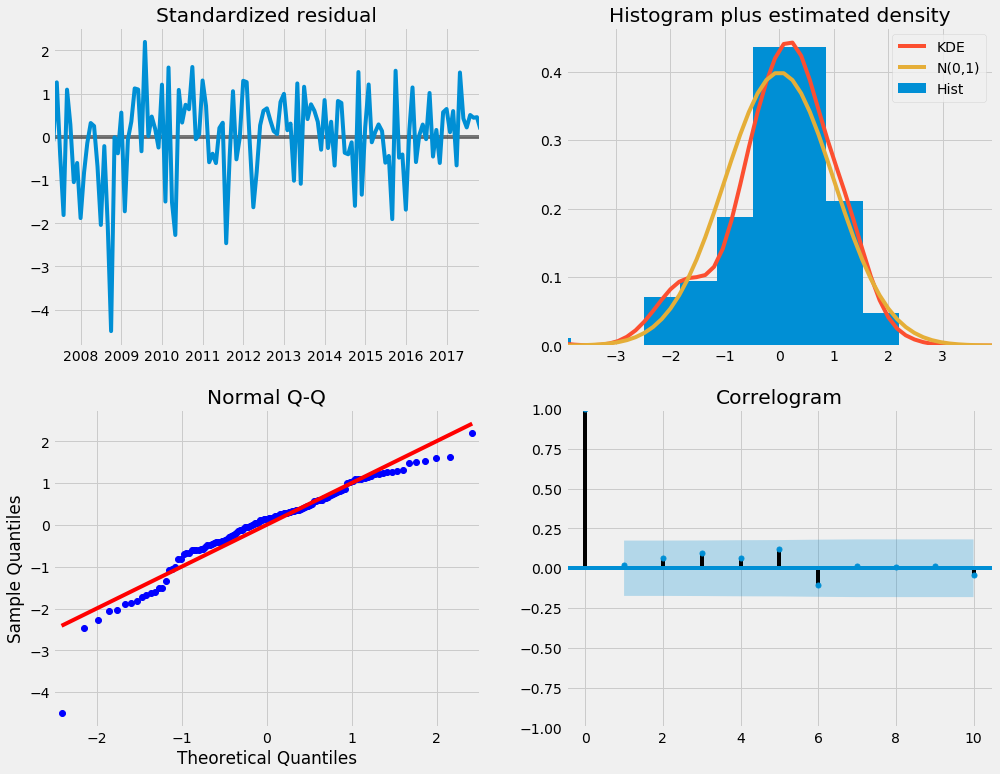
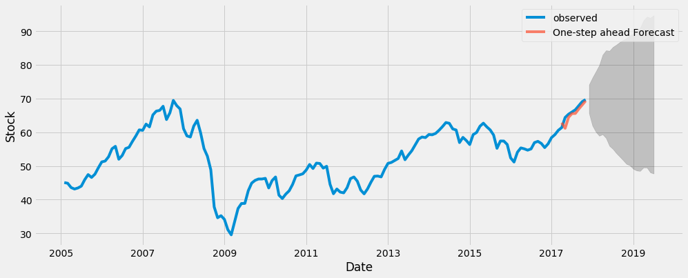
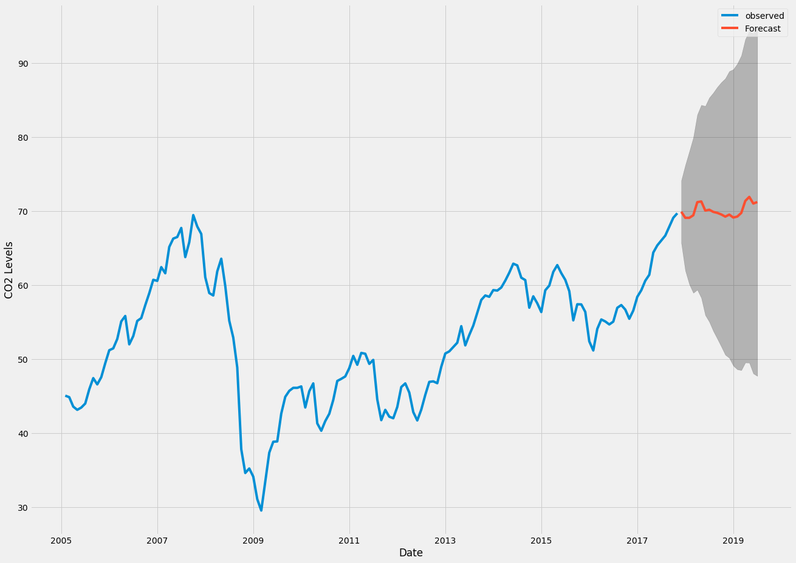

```python
import pandas as pd
import numpy as np
import matplotlib.pylab as plt
%matplotlib inline
from matplotlib.pylab import rcParams
rcParams['figure.figsize'] = 15, 6
from datetime import datetime
from statsmodels.tsa.arima_model import ARIMA
from sklearn.metrics import mean_squared_error
import os
import warnings
import itertools
import pandas as pd
import numpy as np
import statsmodels.api as sm
import matplotlib.pyplot as plt
plt.style.use('fivethirtyeight')
```


```python
# pwd
```


```python
data = pd.read_csv('Data/efa.us.txt')
```


```python
data = data[['Date', 'Close']]
data=data.set_index(data.Date)
# data=data.drop("Date",axis=1)
data.index = pd.DatetimeIndex(data.index)
data.head()
y=data
data.head()
```


<div>
<style scoped>
    .dataframe tbody tr th:only-of-type {
        vertical-align: middle;
    }

    .dataframe tbody tr th {
        vertical-align: top;
    }

    .dataframe thead th {
        text-align: right;
    }
</style>
<table border="1" class="dataframe">
  <thead>
    <tr style="text-align: right;">
      <th></th>
      <th>Date</th>
      <th>Close</th>
    </tr>
    <tr>
      <th>Date</th>
      <th></th>
      <th></th>
    </tr>
  </thead>
  <tbody>
    <tr>
      <th>2005-02-25</th>
      <td>2005-02-25</td>
      <td>45.119</td>
    </tr>
    <tr>
      <th>2005-02-28</th>
      <td>2005-02-28</td>
      <td>45.010</td>
    </tr>
    <tr>
      <th>2005-03-01</th>
      <td>2005-03-01</td>
      <td>45.257</td>
    </tr>
    <tr>
      <th>2005-03-02</th>
      <td>2005-03-02</td>
      <td>44.919</td>
    </tr>
    <tr>
      <th>2005-03-03</th>
      <td>2005-03-03</td>
      <td>44.945</td>
    </tr>
  </tbody>
</table>
</div>


```python
y = data['Close'].resample('MS').mean()
```


```python
# The term bfill means that we use the value before filling in missing values
y = y.fillna(y.bfill())
print(y)
```

    Date
    2005-02-01    45.064500
    2005-03-01    44.856909
    2005-04-01    43.581524
    2005-05-01    43.149000
    2005-06-01    43.455273
    2005-07-01    44.001200
    2005-08-01    45.920130
    2005-09-01    47.430857
    2005-10-01    46.585048
    2005-11-01    47.558619
    2005-12-01    49.453048
    2006-01-01    51.197850
    2006-02-01    51.452474
    2006-03-01    52.721739
    2006-04-01    55.092684
    2006-05-01    55.825636
    2006-06-01    51.992364
    2006-07-01    53.110850
    2006-08-01    55.155435
    2006-09-01    55.540450
    2006-10-01    57.282955
    2006-11-01    58.897571
    2006-12-01    60.708900
    2007-01-01    60.565700
    2007-02-01    62.423632
    2007-03-01    61.592136
    2007-04-01    65.147950
    2007-05-01    66.276682
    2007-06-01    66.490714
    2007-07-01    67.714333
                    ...    
    2015-06-01    61.610500
    2015-07-01    60.699727
    2015-08-01    59.176238
    2015-09-01    55.234476
    2015-10-01    57.409455
    2015-11-01    57.388000
    2015-12-01    56.374182
    2016-01-01    52.391474
    2016-02-01    51.164500
    2016-03-01    54.083545
    2016-04-01    55.354429
    2016-05-01    55.083857
    2016-06-01    54.680818
    2016-07-01    55.061400
    2016-08-01    56.928826
    2016-09-01    57.299857
    2016-10-01    56.687714
    2016-11-01    55.447952
    2016-12-01    56.560952
    2017-01-01    58.408050
    2017-02-01    59.298000
    2017-03-01    60.585087
    2017-04-01    61.390105
    2017-05-01    64.393727
    2017-06-01    65.357500
    2017-07-01    66.019500
    2017-08-01    66.681304
    2017-09-01    67.877000
    2017-10-01    69.089091
    2017-11-01    69.696250
    Freq: MS, Name: Close, Length: 154, dtype: float64


```python
y.plot(figsize=(15, 6))
plt.show()
```





```python
p = d = q = range(0, 2)

# Generate all different combinations of p, q and q triplets
pdq = list(itertools.product(p, d, q))

# Generate all different combinations of seasonal p, q and q triplets
seasonal_pdq = [(x[0], x[1], x[2], 12) for x in list(itertools.product(p, d, q))]

print('Examples of parameter combinations for Seasonal ARIMA...')
print('SARIMAX: {} x {}'.format(pdq[1], seasonal_pdq[1]))
print('SARIMAX: {} x {}'.format(pdq[1], seasonal_pdq[2]))
print('SARIMAX: {} x {}'.format(pdq[2], seasonal_pdq[3]))
print('SARIMAX: {} x {}'.format(pdq[2], seasonal_pdq[4]))
```

    Examples of parameter combinations for Seasonal ARIMA...
    SARIMAX: (0, 0, 1) x (0, 0, 1, 12)
    SARIMAX: (0, 0, 1) x (0, 1, 0, 12)
    SARIMAX: (0, 1, 0) x (0, 1, 1, 12)
    SARIMAX: (0, 1, 0) x (1, 0, 0, 12)


```python
warnings.filterwarnings("ignore") # specify to ignore warning messages

for param in pdq:
    for param_seasonal in seasonal_pdq:
        try:
            mod = sm.tsa.statespace.SARIMAX(y,
                                            order=param,
                                            seasonal_order=param_seasonal,
                                            enforce_stationarity=False,
                                            enforce_invertibility=False)

            results = mod.fit()

            print('ARIMA{}x{}12 - AIC:{}'.format(param, param_seasonal, results.aic))
        except:
            continue
```

    ARIMA(0, 0, 0)x(0, 0, 0, 12)12 - AIC:1654.4758533585148
    ARIMA(0, 0, 0)x(0, 0, 1, 12)12 - AIC:1385.9666525612881
    ARIMA(0, 0, 0)x(0, 1, 0, 12)12 - AIC:1066.6666661384402
    ARIMA(0, 0, 0)x(0, 1, 1, 12)12 - AIC:962.7350892225862
    ARIMA(0, 0, 0)x(1, 0, 0, 12)12 - AIC:1075.2327361797431
    ARIMA(0, 0, 0)x(1, 0, 1, 12)12 - AIC:1047.057369875838
    ARIMA(0, 0, 0)x(1, 1, 0, 12)12 - AIC:983.2259914557299
    ARIMA(0, 0, 0)x(1, 1, 1, 12)12 - AIC:964.2288442543152
    ARIMA(0, 0, 1)x(0, 0, 0, 12)12 - AIC:1442.1193530972632
    ARIMA(0, 0, 1)x(0, 0, 1, 12)12 - AIC:1191.9011713829184
    ARIMA(0, 0, 1)x(0, 1, 0, 12)12 - AIC:892.4093613842082
    ARIMA(0, 0, 1)x(0, 1, 1, 12)12 - AIC:803.1862759772723
    ARIMA(0, 0, 1)x(1, 0, 0, 12)12 - AIC:906.999378207076
    ARIMA(0, 0, 1)x(1, 0, 1, 12)12 - AIC:901.1139269448282
    ARIMA(0, 0, 1)x(1, 1, 0, 12)12 - AIC:829.8519123377162
    ARIMA(0, 0, 1)x(1, 1, 1, 12)12 - AIC:806.1003804809964
    ARIMA(0, 1, 0)x(0, 0, 0, 12)12 - AIC:666.2251969956164
    ARIMA(0, 1, 0)x(0, 0, 1, 12)12 - AIC:622.2381825108919
    ARIMA(0, 1, 0)x(0, 1, 0, 12)12 - AIC:729.1476790296683
    ARIMA(0, 1, 0)x(0, 1, 1, 12)12 - AIC:593.630481462341
    ARIMA(0, 1, 0)x(1, 0, 0, 12)12 - AIC:626.4707111765852
    ARIMA(0, 1, 0)x(1, 0, 1, 12)12 - AIC:624.0808719466356
    ARIMA(0, 1, 0)x(1, 1, 0, 12)12 - AIC:648.0654161444631
    ARIMA(0, 1, 0)x(1, 1, 1, 12)12 - AIC:598.8444043964973
    ARIMA(0, 1, 1)x(0, 0, 0, 12)12 - AIC:646.3756867521222
    ARIMA(0, 1, 1)x(0, 0, 1, 12)12 - AIC:604.4075480510207
    ARIMA(0, 1, 1)x(0, 1, 0, 12)12 - AIC:707.6452515283008
    ARIMA(0, 1, 1)x(0, 1, 1, 12)12 - AIC:572.4758439046523
    ARIMA(0, 1, 1)x(1, 0, 0, 12)12 - AIC:612.4785692123955
    ARIMA(0, 1, 1)x(1, 0, 1, 12)12 - AIC:606.3587659318896
    ARIMA(0, 1, 1)x(1, 1, 0, 12)12 - AIC:632.3223270121172
    ARIMA(0, 1, 1)x(1, 1, 1, 12)12 - AIC:580.925822814006
    ARIMA(1, 0, 0)x(0, 0, 0, 12)12 - AIC:671.0385460643967
    ARIMA(1, 0, 0)x(0, 0, 1, 12)12 - AIC:627.6969899656831
    ARIMA(1, 0, 0)x(0, 1, 0, 12)12 - AIC:732.861681961991
    ARIMA(1, 0, 0)x(0, 1, 1, 12)12 - AIC:598.8918163310284
    ARIMA(1, 0, 0)x(1, 0, 0, 12)12 - AIC:628.1244654824391
    ARIMA(1, 0, 0)x(1, 0, 1, 12)12 - AIC:629.6060393959033
    ARIMA(1, 0, 0)x(1, 1, 0, 12)12 - AIC:647.6504430207181
    ARIMA(1, 0, 0)x(1, 1, 1, 12)12 - AIC:604.9195768888469
    ARIMA(1, 0, 1)x(0, 0, 0, 12)12 - AIC:651.9007099751168
    ARIMA(1, 0, 1)x(0, 0, 1, 12)12 - AIC:610.8931378305066
    ARIMA(1, 0, 1)x(0, 1, 0, 12)12 - AIC:709.6366237405014
    ARIMA(1, 0, 1)x(0, 1, 1, 12)12 - AIC:578.5551987934693
    ARIMA(1, 0, 1)x(1, 0, 0, 12)12 - AIC:614.3600826986981
    ARIMA(1, 0, 1)x(1, 0, 1, 12)12 - AIC:610.8163797638649
    ARIMA(1, 0, 1)x(1, 1, 0, 12)12 - AIC:630.2935082601159
    ARIMA(1, 0, 1)x(1, 1, 1, 12)12 - AIC:586.3693088278567
    ARIMA(1, 1, 0)x(0, 0, 0, 12)12 - AIC:652.3630415893051
    ARIMA(1, 1, 0)x(0, 0, 1, 12)12 - AIC:610.6628515256442
    ARIMA(1, 1, 0)x(0, 1, 0, 12)12 - AIC:715.6867686662147
    ARIMA(1, 1, 0)x(0, 1, 1, 12)12 - AIC:579.9802766401285
    ARIMA(1, 1, 0)x(1, 0, 0, 12)12 - AIC:610.8110833833543
    ARIMA(1, 1, 0)x(1, 0, 1, 12)12 - AIC:612.662261921054
    ARIMA(1, 1, 0)x(1, 1, 0, 12)12 - AIC:629.1022575523915
    ARIMA(1, 1, 0)x(1, 1, 1, 12)12 - AIC:587.0097268763276
    ARIMA(1, 1, 1)x(0, 0, 0, 12)12 - AIC:647.6933443558531
    ARIMA(1, 1, 1)x(0, 0, 1, 12)12 - AIC:605.461030996969
    ARIMA(1, 1, 1)x(0, 1, 0, 12)12 - AIC:708.0766087239901
    ARIMA(1, 1, 1)x(0, 1, 1, 12)12 - AIC:574.0049659223611
    ARIMA(1, 1, 1)x(1, 0, 0, 12)12 - AIC:610.6931584454258
    ARIMA(1, 1, 1)x(1, 0, 1, 12)12 - AIC:607.4247362901806
    ARIMA(1, 1, 1)x(1, 1, 0, 12)12 - AIC:630.0591790259091
    ARIMA(1, 1, 1)x(1, 1, 1, 12)12 - AIC:582.7007273660271


```python
# ARIMA(1, 1, 1)x(1, 1, 1, 12)12 - AIC:582.7007273660271
# lowerst AIC 
#Enter Below
```


```python
model = sm.tsa.statespace.SARIMAX(y,
                                order=(1, 1, 1),
                                seasonal_order=(1, 1, 1, 12),
                                enforce_stationarity=False,
                                enforce_invertibility=False)

results = mod.fit()

print(results.summary().tables[1])
```

    ==============================================================================
                     coef    std err          z      P>|z|      [0.025      0.975]
    ------------------------------------------------------------------------------
    ar.L1         -0.1977      0.266     -0.743      0.458      -0.719       0.324
    ma.L1          0.5520      0.210      2.628      0.009       0.140       0.964
    ar.S.L12      -0.1535      0.124     -1.242      0.214      -0.396       0.089
    ma.S.L12      -1.0000   1029.706     -0.001      0.999   -2019.187    2017.187
    sigma2         4.2617   4388.443      0.001      0.999   -8596.929    8605.452
    ==============================================================================


```python
results.plot_diagnostics(figsize=(15, 12))
plt.show()
```





```python

```


<div>
<style scoped>
    .dataframe tbody tr th:only-of-type {
        vertical-align: middle;
    }

    .dataframe tbody tr th {
        vertical-align: top;
    }

    .dataframe thead th {
        text-align: right;
    }
</style>
<table border="1" class="dataframe">
  <thead>
    <tr style="text-align: right;">
      <th></th>
      <th>lower Close</th>
      <th>upper Close</th>
    </tr>
    <tr>
      <th>Date</th>
      <th></th>
      <th></th>
    </tr>
  </thead>
  <tbody>
    <tr>
      <th>2017-04-01</th>
      <td>58.587799</td>
      <td>67.041163</td>
    </tr>
    <tr>
      <th>2017-05-01</th>
      <td>56.954453</td>
      <td>65.407002</td>
    </tr>
    <tr>
      <th>2017-06-01</th>
      <td>60.216285</td>
      <td>68.668586</td>
    </tr>
    <tr>
      <th>2017-07-01</th>
      <td>61.322829</td>
      <td>69.775054</td>
    </tr>
    <tr>
      <th>2017-08-01</th>
      <td>61.363617</td>
      <td>69.815820</td>
    </tr>
  </tbody>
</table>
</div>


```python
pred_ci
```


<div>
<style scoped>
    .dataframe tbody tr th:only-of-type {
        vertical-align: middle;
    }

    .dataframe tbody tr th {
        vertical-align: top;
    }

    .dataframe thead th {
        text-align: right;
    }
</style>
<table border="1" class="dataframe">
  <thead>
    <tr style="text-align: right;">
      <th></th>
      <th>lower Close</th>
      <th>upper Close</th>
    </tr>
    <tr>
      <th>Date</th>
      <th></th>
      <th></th>
    </tr>
  </thead>
  <tbody>
    <tr>
      <th>2017-04-01</th>
      <td>58.587799</td>
      <td>67.041163</td>
    </tr>
    <tr>
      <th>2017-05-01</th>
      <td>56.954453</td>
      <td>65.407002</td>
    </tr>
    <tr>
      <th>2017-06-01</th>
      <td>60.216285</td>
      <td>68.668586</td>
    </tr>
    <tr>
      <th>2017-07-01</th>
      <td>61.322829</td>
      <td>69.775054</td>
    </tr>
    <tr>
      <th>2017-08-01</th>
      <td>61.363617</td>
      <td>69.815820</td>
    </tr>
    <tr>
      <th>2017-09-01</th>
      <td>62.695651</td>
      <td>71.147847</td>
    </tr>
    <tr>
      <th>2017-10-01</th>
      <td>63.880150</td>
      <td>72.332344</td>
    </tr>
    <tr>
      <th>2017-11-01</th>
      <td>65.092690</td>
      <td>73.544884</td>
    </tr>
  </tbody>
</table>
</div>


```python
ax = y['2005-02-01':].plot(label='observed')
pred.predicted_mean.plot(ax=ax, label='One-step ahead Forecast', alpha=.7)

ax.fill_between(pred_ci.index,
                pred_ci.iloc[:, 0],
                pred_ci.iloc[:, 1], color='k', alpha=.2)

ax.set_xlabel('Date')
ax.set_ylabel('Stock')
plt.legend()

plt.show()
```





```python
y_forecasted = pred.predicted_mean
y_truth = y['2010-01-01':]

# Compute the mean square error
mse = ((y_forecasted - y_truth) ** 2).mean()
print('The Mean Squared Error of our forecasts is {}'.format(round(mse, 2)))
# The Mean Squared Error of our forecasts is 2.08
# Get forecast 500 steps ahead in future
pred_uc = results.get_forecast(steps=20)

# Get confidence intervals of forecasts
pred_ci = pred_uc.conf_int()
ax = y.plot(label='observed', figsize=(20, 15))
pred_uc.predicted_mean.plot(ax=ax, label='Forecast')
ax.fill_between(pred_ci.index,
                pred_ci.iloc[:, 0],
                pred_ci.iloc[:, 1], color='k', alpha=.25)
ax.set_xlabel('Date')
ax.set_ylabel('CO2 Levels')

plt.legend()
plt.show()
```

    The Mean Squared Error of our forecasts is 2.08


```python
# Get forecast 500 steps ahead in future
pred_uc = results.get_forecast(steps=20)

# Get confidence intervals of forecasts
pred_ci = pred_uc.conf_int()
```


```python
ax = y.plot(label='observed', figsize=(20, 15))
pred_uc.predicted_mean.plot(ax=ax, label='Forecast')
ax.fill_between(pred_ci.index,
                pred_ci.iloc[:, 0],
                pred_ci.iloc[:, 1], color='k', alpha=.25)
ax.set_xlabel('Date')
ax.set_ylabel('CO2 Levels')

plt.legend()
plt.show()
```





```python
# y = data
# y.head()
# # y.index = pd.DatetimeIndex(y.index)
# y.describe()
# # The 'MS' string groups the data in buckets by start of the month
# y = y['Date'].resample('MS').mean()

# # The term bfill means that we use the value before filling in missing values
# y = y.fillna(y.bfill())

# print(y)

# # 3
# # 4
# # 5
# # 6
# # 7
# # 8
# # # specify training data
# # data = ...
# # # define model
# # model = SARIMAX(data, order=..., seasonal_order=...)
# # # fit model
# # model_fit = model.fit()
# # # one step forecast
# # yhat = model_fit.predict(start=len(data), end=len(data))


# # # MODEL Fit 

# # mod = sm.tsa.statespace.SARIMAX(y,
# #                                 order=(1, 1, 1),
# #                                 seasonal_order=(1, 1, 1, 12),
# #                                 enforce_stationarity=False,
# #                                 enforce_invertibility=False)
# # results = mod.fit()
# # print(results.summary().tables[1])

# # #run before implment
# # results.plot_diagnostics(figsize=(15, 12))
# # plt.show()

# # #Get Prediction
# # pred = results.get_prediction(start=pd.to_datetime('1998-01-01'), dynamic=False)
# # pred_ci = pred.conf_int()

# # #Get accuracy of forecast 
# # y_forecasted = pred.predicted_mean
# # y_truth = y['1998-01-01':]

# # # Compute the mean square error
# # mse = ((y_forecasted - y_truth) ** 2).mean()
# # print('The Mean Squared Error of our forecasts is {}'.format(round(mse, 2)))

# # # Get forecast 500 steps ahead in future
# # pred_uc = results.get_forecast(steps=500)

# # # Get confidence intervals of forecasts
# # pred_ci = pred_uc.conf_int()# READING DATA
# # # The P>|z| column informs us of the significance of each feature weight. Here, each weight has a p-value lower or close to 0.05, so it is reasonable to retain all of them in our model.
```


```python

```
